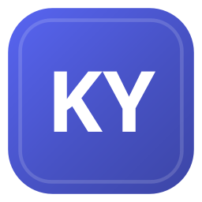

<p align="center">
  
</p>

<p align="center">
  <strong>KY-GamePlayer — KodYazar Client</strong><br/>
  Desktop Discord panel: Rich Presence, 24k-game catalog, quests, HypeSquad, science hours.
</p>

<p align="center">
  
  
  
  
  <a href="https://github.com/KodYazicam/KY-GamePlayer/actions"></a>
</p>

<p align="center">
  <a href="./README.md">English</a> ·
  <a href="./docs/README.tr.md">Türkçe</a>
</p>

```
Author : Batuhan (KodYazicam)
Project: KY-GamePlayer (KodYazar Client)
Source : https://github.com/KodYazicam/KY-GamePlayer
```

**KYAL-1.0** — free to use and modify. Attribution is **mandatory** in LICENSE, this README, and any public product that ships this code. Example credit: `Powered by KY-GamePlayer — KodYazicam`.

Not on PyPI. Clone the repo. Discord Stable / Canary / PTB / Vesktop / Vencord on **Linux, Windows, macOS**.

This is a **local user client**. It reads the already-logged-in Discord token on this machine and talks to Discord IPC + API v9. It does not send credentials to KodYazicam. Unofficial user-token automation can violate Discord’s terms — you run it at your own risk. See [Security](#security).

---

## Table of contents

1. [What this is (and is not)](#what-this-is-and-is-not)
2. [Feature surface](#feature-surface)
3. [Requirements](#requirements)
4. [Install and first boot](#install-and-first-boot)
5. [Membership lock](#membership-lock)
6. [Tabs](#tabs)
7. [Games / Rich Presence](#games--rich-presence)
8. [Science farm](#science-farm)
9. [Quests](#quests)
10. [Account, badges, privacy](#account-badges-privacy)
11. [Data on disk](#data-on-disk)
12. [Keyboard](#keyboard)
13. [Project layout](#project-layout)
14. [Development plan](#development-plan)
15. [Tests and CI](#tests-and-ci)
16. [Troubleshooting](#troubleshooting)
17. [FAQ](#faq)
18. [License](#license--kyal-10)

Long form:

- Install per OS → [`docs/install.md`](docs/install.md)
- Every control → [`docs/features.md`](docs/features.md)
- Boot / threads / IPC → [`docs/architecture.md`](docs/architecture.md)
- REST + science events → [`docs/discord.md`](docs/discord.md)
- JSON schemas / paths → [`docs/data.md`](docs/data.md)
- Failures → [`docs/troubleshooting.md`](docs/troubleshooting.md)
- Roadmap copy → [`docs/roadmap.md`](docs/roadmap.md)

---

## What this is (and is not)

**Is:** a PySide6 desktop app named **KodYazar Client**. After you join the KodYazar Discord server, it can:

- Set Discord Rich Presence from Discord’s detectable game catalog (**24 314** titles in `games.json`)
- Detect a running `.exe` / binary and push that game as Playing
- Rotate games (random + weights), cycle details/state text, schedule hours, pin extra IPC slots
- Join/leave HypeSquad houses, set profile visibility, custom status, clan tag
- List and complete accepted Discord Quests (video ticks / play-stream heartbeats)
- POST Discord `/science` launch + heartbeat events so “hours played” / “games played” counters can move

**Is not:** a Discord bot, a hosted SaaS, a game launcher, a cheat client, or a way to obtain Staff/Partner/Bug Hunter badges. Gift/Nitro milestone art is a catalog, not an unlocker.

---

## Feature surface

| Area | What ships in 1.0.0 |
| --- | --- |
| Shell | Dark Fusion UI, tray, single instance, TR/EN, autostart (Linux/Windows/macOS) |
| Lock | Harvest token from Discord/Vesktop Local Storage; optional paste; guild membership required |
| Games | Search, theme/store/OS/icon/cover/overlay filters, favorites, playlist, exclude, weights |
| RPC | Playing/Streaming/Listening/Watching/Custom/Competing, assets, party, buttons xor secrets, flags |
| Detect | Process scan every 5 s; Proton/Wine exe tokens; PID fill |
| Random | Weighted pool, no-repeat N, countdown, Ctrl+R |
| Extras | Up to 8 extra IPC connections (Vesktop may stack; official Discord shows one Playing) |
| Cycle / schedule | Line-based frames; time window; idle clear; auto-reconnect |
| Science | Hours or “played 1 min”; batch/delay/jitter; pull credentials; DPAPI on Windows |
| Quests | Scan, enroll, video 1 s, heartbeat ~20 s, claim |
| Badges | HypeSquad apply/leave; owned flags; gift/Nitro catalog |
| Privacy | Private / limited / public cards |
| Account | Custom status, clan/primary guild, entitlement count |
| Packaging | `kurulum.bat` / `windows.bat`; PyInstaller spec |

---

## Requirements

- Python **3.11+**
- `PySide6>=6.6,<7`
- `cryptography>=42` (Chromium cookie `v10`/`v11` AES-GCM)
- Discord desktop (or Vesktop / Vencord) **running** for IPC
- Membership in [KodYazar Client](https://discord.gg/rS42FCPfKZ) (`1549516395010854912`)

Chrome App-Bound cookies (`v20`) are **not** decrypted. Paste cookie if harvest fails.

---

## Install and first boot

```bash
git clone https://github.com/KodYazicam/KY-GamePlayer.git
cd KY-GamePlayer
python3 -m pip install -r requirements.txt
python3 run.py
```

Windows:

- **Release zip:** [Releases](https://github.com/KodYazicam/KY-GamePlayer/releases) → `KodYazar-Client-v*-windows-x64.zip` → unzip → `KodYazar\KodYazar.exe` (keep `_internal`). Hashes + VirusTotal permalinks: [`docs/HASHES-v1.0.0.md`](docs/HASHES-v1.0.0.md).
- **From source:** `kurulum.bat` once, then `windows.bat`.
- **Local EXE:** `packaging\windows\build.bat` → `dist\KodYazar\KodYazar.exe`.

macOS: same `pip` + `run.py`. Token/IPC under Application Support / tmp.

First boot:

1. Open Discord and log in.
2. Join <https://discord.gg/rS42FCPfKZ>
3. Start this app. Lock harvests the token. Paste if files are locked.
4. Main UI unlocks only when the account is in the guild.

Ctrl+C / SIGTERM quit. Close-to-tray when a tray icon exists.

Full OS notes: [`docs/install.md`](docs/install.md).

---

## Membership lock

`brand.py` constants:

| | |
| --- | --- |
| Guild | KodYazar Client |
| Id | `1549516395010854912` |
| Invite | `https://discord.gg/rS42FCPfKZ` |

Check: `GET /users/@me` then paginated `/users/@me/guilds`, fallback guild member routes. Timeout 20 s. Changing the guild means changing `brand.py` and this README together.

---

## Tabs

Order in the window:

1. **Rozet kontrol / Badge control** — Bravery / Brilliance / Balance
2. **Tüm rozetler / All badges** — catalog + owned flags
3. **Oyun menüsü / Games** — catalog + RPC editor (the large tab)
4. **Profil gizliliği / Profile privacy**
5. **Görevler / Quests**
6. **Hesap / Account**
7. **Yardım / Help**

Every widget: [`docs/features.md`](docs/features.md).

---

## Games / Rich Presence

`games.json` is Discord’s detectable list (24 314 games, ~12.7 MB). Each row is an application id you handshake as `client_id`.

Connect talks Discord RPC:

- Windows `\\.\pipe\discord-ipc-0` … `-9`
- Linux `$XDG_RUNTIME_DIR/discord-ipc-N` plus Flatpak/Snap/Vesktop subdirs
- macOS tmp + Application Support

`SET_ACTIVITY` payload is built in `activity.ActivityConfig` (type, details/state + URLs, timestamps, assets, party, buttons **or** secrets, flags, emoji, instance). Preview paints a Discord-like card.

Detect maps running process names to `executables[]` (launchers skipped).

---

## Science farm

Not Rich Presence. `POST https://discord.com/api/v9/science` with `launch_game` + `running_game_heartbeat` events, using `analytics_token` from `GET /users/@me?with_analytics_token=true`.

| Mode | Effect |
| --- | --- |
| Saat ekle / Add hours | `duration_tracked_ms = hours × 3600 × 1000` |
| Oynandı / Played | 60 s duration; successful ids stored in `profiles.json` `played` |

Needs token + cookie. Fingerprint (`executable_fingerprint`) from Discord’s own detect improves counters. Autonomous checkboxes fire on RPC update / random / detect. **Do not** blast all 24k games without reading [`docs/discord.md`](docs/discord.md) and Discord’s terms.

Credentials: `science_state.json` (Windows DPAPI `KY1\x00` prefix, else mode `0600`).

---

## Quests

`GET /quests/@me`. Supported tasks: `WATCH_VIDEO`, `WATCH_VIDEO_ON_MOBILE`, `PLAY_ON_DESKTOP`, `STREAM_ON_DESKTOP`, `PLAY_ACTIVITY`. Video ≈ 1 s ticks. Play/stream ≈ 20 s heartbeats with `stream_key` from a DM. Then claim-reward fallbacks. Accept the quest in Discord Quest Home first.

---

## Account, badges, privacy

- HypeSquad: `POST/DELETE /hypesquad/online`
- Privacy cards: profile_visibility + friend_source_flags
- Custom status + clan / primary guild
- Entitlements length (Orbs **balance** stays in Discord’s wallet)
- Badge tab explains Staff/Partner/etc. — this app cannot grant them

---

## Data on disk

| | Config | Cache / log |
| --- | --- | --- |
| Windows | `%APPDATA%\kodyazar` | `%LOCALAPPDATA%\kodyazar` |
| Linux | `~/.config/kodyazar` | `~/.cache/kodyazar` |
| macOS | `~/Library/Application Support/kodyazar` | `~/Library/Caches/kodyazar` |

| File | Sensitivity |
| --- | --- |
| `science_state.json` | **High** — token, cookie, analytics, fingerprint |
| `profiles.json` | RPC presets, favorites, settings (no token) |
| `logs/kodyazar-YYYYMMDD.log` | IPC / quest / science status |
| `cdn/` | Downloaded PNG icons |

Schemas: [`docs/data.md`](docs/data.md).

---

## Keyboard

| Shortcut | Action |
| --- | --- |
| Ctrl+R | Random game now |
| Ctrl+U | Update RPC |
| Ctrl+L | Clear activity |
| Ctrl+P | Pin extra IPC slot |
| Ctrl+D | Scan processes |
| Ctrl+F | Toggle favorite |
| Ctrl+Shift+S | Fill store button from SKU |

---

## Project layout

```
KY-GamePlayer/
  run.py                 CLI entry
  games.json             Discord detectables (~24k)
  requirements.txt
  pyproject.toml         name kodyazar-client, script kodyazar
  kurulum.bat / windows.bat
  kodyazar.desktop.in
  ky_gameplayer/         package — see ky_gameplayer/README.md
  assets/                app icons
  packaging/windows/     PyInstaller
  tests/                 Qt-free unittest
  docs/                  manuals
```

---

## Development plan

Full checklist: [`docs/roadmap.md`](docs/roadmap.md). Short version:

| Stage | Goal |
| --- | --- |
| **1.0.x now** | Docs, CI, GitHub, `icon.ico`, Windows release zip. Social preview still open. |
| **1.1** | Catalog sync CLI, Linux desktop install without rewriting git files, macOS `.app`, persist window geometry |
| **1.2** | Owned-app asset browser, Listening helper, extra-slot UX when official Discord cannot stack |
| **1.3** | Science dry-run, fingerprint capture UI, confirm before farming the full catalog |
| **2.0** | Script hooks, multi-account identity files, signed binaries. **No** telemetry unless opt-in |

Out of scope: v20 cookie decrypt, hosting tokens, bot-token mode, fake Staff badges.

---

## Tests and CI

```bash
python -m compileall -q ky_gameplayer run.py tests
python -m unittest discover -s tests -v
```

GitHub Actions: Python 3.11 / 3.12 / 3.13, no PySide6 install. Tests cover activity JSON, catalog load, science helpers, quest parse, profiles, detect matching.

---

## Troubleshooting

IPC missing, cookie v20, membership fail, science 401, quest stuck: [`docs/troubleshooting.md`](docs/troubleshooting.md).

Quick hits:

- Discord must be open before **Bağlan**
- Join the guild on the **same** account as the harvested token
- WSL cannot see Windows named pipes — run on Windows
- Copy the whole `dist\KodYazar` folder, not only the exe

---

## FAQ

**Why harvest a user token?** So HypeSquad, quests, science, and membership work as the logged-in desktop user. The token never leaves this machine except toward `discord.com`.

**Why a guild lock?** Product gate for KodYazar Client. Forks can change `brand.py`.

**Can I use a custom Application ID?** Yes — type it in Identity. Verified catalog games ignore custom `name`.

**Does extra pin show two games?** Official Discord: no. Vesktop/arRPC: maybe.

**Is `games.json` complete?** It is Discord’s detectable dump at ship time. Refresh later via planned 1.1 sync (`cdn.discordapp.com/detectables/games.json`).

---

## License — KYAL-1.0

See [`LICENSE`](LICENSE). Keep the attribution block above in forks and public binaries.
